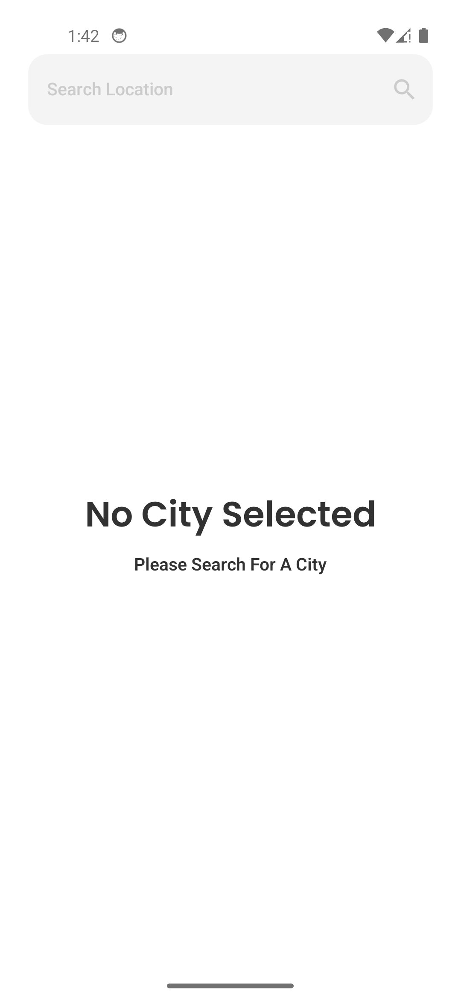
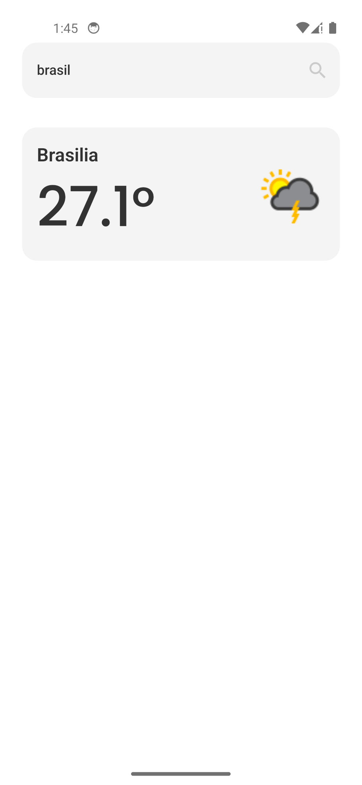
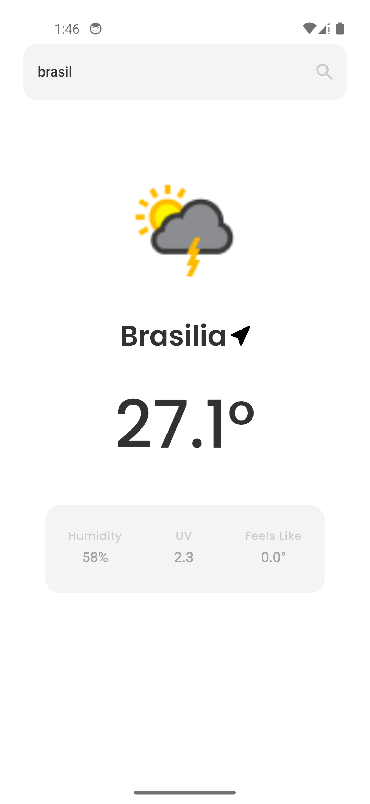
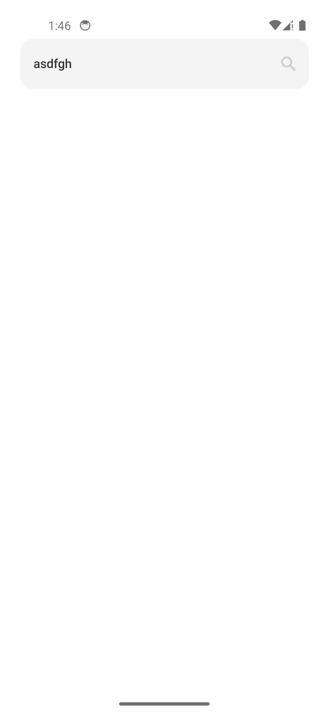
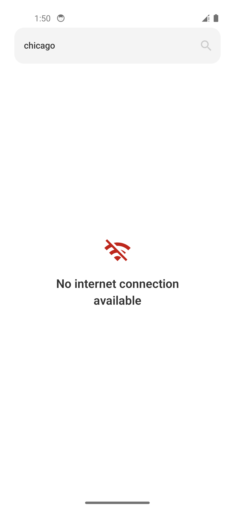
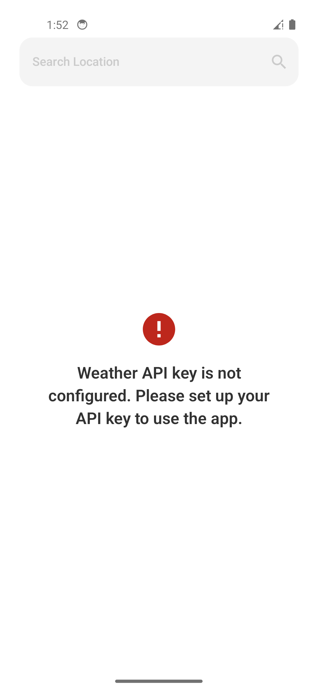
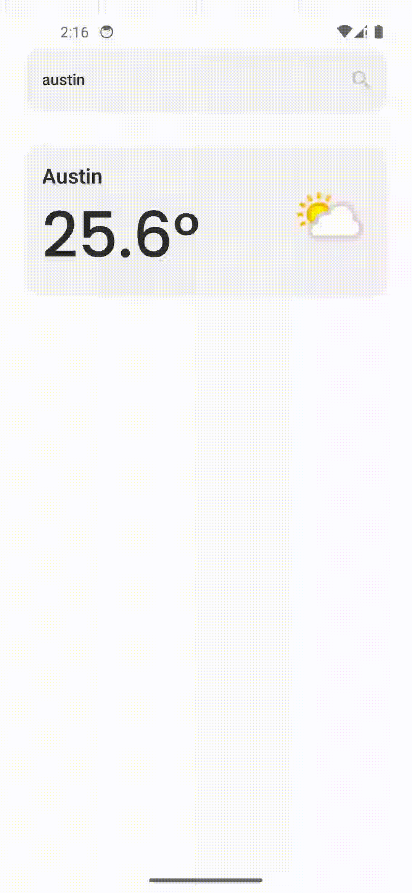

# Weather Tracker App

A weather app built using Kotlin, Jetpack Compose, and clean architecture principles. The app allows users to search for a city, display its weather, and persist the selected city across launches. The app fetches weather data from the WeatherAPI.com service.

## Features
- Search for a city and display its weather details including:
  - Temperature
  - Weather condition (with corresponding icon)
  - Humidity (%)
  - UV index
  - "Feels like" temperature
- Save and persist the selected city across app launches.
- Supports dark and light themes.
- Fetches weather data using the WeatherAPI.com.

## Screenshots
- Here are some screenshots of the app in action:

<div style="display: flex; gap: 10px;">
  
  
  
  
</div>

- Some error cases:

<div style="display: flex; gap: 10px;">
  
  
</div>

- Transition animation:



## Tech Stack
- **Kotlin**: Programming language.
- **Jetpack Compose**: UI framework.
- **Hilt**: Dependency Injection.
- **Ksp**: Kotlin Symbol Processing.
- **MVVM**: Architecture.
- **WeatherAPI.com**: Weather data API.
- **Coroutines & StateFlow**: For asynchronous data handling and state management.
- **GitHub Actions**: Continuous Integration (CI) to automate the build, test, and deployment processes. 

## Modular Architecture
The app is organized into multiple modules to separate concerns and ensure that each feature or functionality can be developed, tested, and maintained independently. The modular structure also makes the app easier to scale and improve in the future.

### Modules Breakdown:
- :app: The main application module that ties all features together.
- :core:arch: Core architectural components like base classes, network, and data layer.
- :core:uikit: Reusable UI components like custom buttons, text fields, and themes.
- :core:utils: Utility functions and helpers used across the project.
- :feature:weather: Contains all weather-related functionality, including API integration, view models, and UI components.
- more features could be added in the future using a similar pattern.

### Architecture Flow:
- Model Layer: Contains the domain logic, including data models and repositories.
- ViewModel Layer: Manages the UI state and orchestrates business logic by interacting with the use cases.
- View Layer: The Composables (UI) that display weather data and interact with the user.
- Each module has a clear responsibility and interacts with other modules through well-defined interfaces, ensuring a clean separation of concerns and facilitating easier maintenance and testing.

## Testing
- Unit tests: Testing business logic, use cases, and repositories.
- UI tests: Testing the UI layer with Jetpack Compose's ComposeTestRule.
- Mocking: Using Mockito/MockK to mock dependencies in unit tests.

## Setup Instructions

### Prerequisites
Ensure you have the following software installed:
- Android Studio (Latest stable version)
- JDK 17 or above

### Clone the repository
Clone this repository to your local machine:
```bash
git clone https://github.com/herotran0504/weather-tracker.git
```

### API Key
You need an API key from WeatherAPI.com. To get one:
- Go to WeatherAPI.com and sign up for a free API key.
- Local Development (Setting the API Key in Environment Variables)
  - On macOS/Linux:
  ```
  export WEATHER_API_KEY="your_api_key_here"
  source ~/.bashrc   # Or source ~/.zshrc if using zsh
  ```
  - On Windows:
  ```
  $env:WEATHER_API_KEY="your_api_key_here"
  ```
- Or Add the API key to your local.properties file (do not commit this file):
  ```
  WEATHER_API_KEY=your_api_key_here
  ```
### Build and Run
- Open the project in Android Studio.
- Ensure that the required dependencies are downloaded.
- Run the app on an emulator or physical device.
- Run the app
- Once the app is running, you can:
  - Search for a city to get its weather details.
  - If no city is selected, a message will be shown prompting you to search for one.
  - The app persists the selected city even after a restart.

